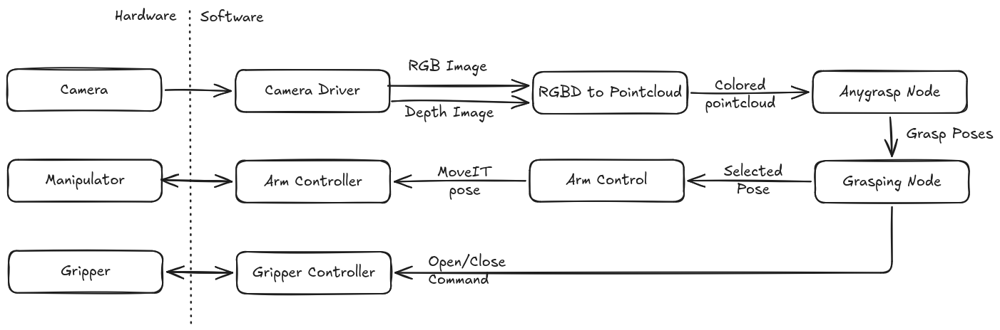

# Anygrasp Grasping

This meta package brings together the [grasping stack](https://github.com/CollaborativeRoboticsLab/grasping), [AnyGrasp](https://github.com/graspnet/anygrasp_sdk), [anygrasp_ros](https://github.com/CollaborativeRoboticsLab/anygrasp_ros), and the gripper stack into one integration flow.

It does the following tasks:

1. Call the configured AnyGrasp service for grasp poses.
2. Forward the selected pose to grasping stack's [grasping_control/motion_execution_node](https://github.com/CollaborativeRoboticsLab/grasping/blob/main/docs/control/control_stack_overview.md) through `grasping_msgs/action/MoveToPose`.
3. Trigger gripper open/close actions and optionally request the post-grasp move.

Read here for [known issues and how we fixed them](./docs/issues.md)

## System Architecture



### RGBD to Pointcloud (via external devcontainer)

As shown in the system architecture diagram, the RGB and depth images are combined into a colored point cloud before grasp detection. This is done by `anygrasp_ros/rgbd_to_pointcloud_node`, which subscribes to the RGB and depth image topics, synchronizes them, and publishes the resulting colored point cloud for grasp pose detection. Check the Anygrasp Node section for instructions on connecting to the external devcontainer.

- [RGBD to Pointcloud Node](https://github.com/CollaborativeRoboticsLab/anygrasp_ros/blob/main/docs/rgbd_to_pointcloud.md)

### AnyGrasp Node (via external devcontainer)

This grasping stack uses AnyGrasp for grasp pose detection. This container does not include AnyGrasp itself, and expects a companion devcontainer to provide AnyGrasp. The AnyGrasp node subscribes to the colored point cloud and publishes the detected grasp poses. The anygrasp_grasping node connects to the AnyGrasp node and requests a grasp pose when triggered.

- [Detection Node](https://github.com/CollaborativeRoboticsLab/anygrasp_ros/blob/main/docs/detection.md)
- [Tracking Node](https://github.com/CollaborativeRoboticsLab/anygrasp_ros/blob/main/docs/tracking.md)

To connect with anygrasp_ros external devcontainer, follow the instructions on [CollaborativeRoboticsLab/anygrasp_ros](https://github.com/CollaborativeRoboticsLab/anygrasp_ros/blob/main/docs/external/dds_configuration.md). Use the `host.xml` file since this container is configured for `network=host` mode. 

### Camera Driver

Camera setup, configuration, and customization are documented in the linked file. The current supported device is:

- [Realsense Camera](https://github.com/CollaborativeRoboticsLab/grasping/blob/main/docs/camera/realsense.md)

### Gripper Controller

This grasping stack supports multiple gripper types. The gripper controller focuses on custom-built grippers using servo configurations documented in [CollaborativeRoboticsLab/grippers](https://github.com/CollaborativeRoboticsLab/grippers). Setup, configuration, and customization details are in the linked documents.

- [Dynamixel Grippers](https://github.com/CollaborativeRoboticsLab/grippers/blob/main/docs/dynamixel.md)
- [Feetech Grippers](https://github.com/CollaborativeRoboticsLab/grippers/blob/main/docs/feetech.md)

### Manipulator 

This grasping stack supports multiple manipulators. The moveit stack uses custom config that contains standard manipulators attached with custom-built grippers and are documented in [CollaborativeRoboticsLab/grasping](https://github.com/CollaborativeRoboticsLab/grasping/blob/main/README.md). Following are the links to the setup, configuration, and customization details for each manipulator.

**UR10 Manipulator**
- [UR10 and Devcontainer connection](https://github.com/CollaborativeRoboticsLab/grasping/blob/main/docs/manipulator/ur10_connection.md)
- [UR10 calibration](https://github.com/CollaborativeRoboticsLab/grasping/blob/main/docs/manipulator/ur10_calibration.md)
- [UR10 tf frames for gripper compatibility](https://github.com/CollaborativeRoboticsLab/grasping/blob/main/docs/manipulator/ur10_tf_frames.md)
- [UR10 startup](https://github.com/CollaborativeRoboticsLab/grasping/blob/main/docs/manipulator/ur10_startup.md)

**TM12S Manipulator**
- [TM12S and Devcontainer connection](https://github.com/CollaborativeRoboticsLab/grasping/blob/main/docs/manipulator/tm12s_connection.md)
- [TM12S tf frames for gripper compatibility](https://github.com/CollaborativeRoboticsLab/grasping/blob/main/docs/manipulator/tm12s_tf_frames.md)

**LD250 &TM12x Mobile Manipulator**
- [LD250 & TM12X and Devcontainer connection](https://github.com/CollaborativeRoboticsLab/grasping/blob/main/docs/manipulator/ld250_tm12x_connection.md)
- [LD250 & TM12X tf frames for gripper compatibility](https://github.com/CollaborativeRoboticsLab/grasping/blob/main/docs/manipulator/ld250_tm12x_tf_frames.md)

**Common**
- [Attaching new gripper and components](https://github.com/CollaborativeRoboticsLab/grasping/blob/main/docs/manipulator/adding_new_components.md)
- [Moveit Servo and Keyboard Teleop](https://github.com/CollaborativeRoboticsLab/grasping/blob/main/docs/manipulator/teleop.md)


### Manipulator Control and Workspace Creation

This component transforms grasp poses, applies workspace obstacles to MoveIt, visualizes the calibrated workspace area, and rejects poses outside that area. This is also available in [CollaborativeRoboticsLab/grasping](https://github.com/CollaborativeRoboticsLab/grasping/blob/main/README.md). Read the linked documents for setup, configuration, and customization details.

- [Workspace Creation](https://github.com/CollaborativeRoboticsLab/grasping/blob/main/docs/workspace/creation.md)
- [Manipulator Control](https://github.com/CollaborativeRoboticsLab/grasping/blob/main/docs/control/arm_control.md)
- [Control stack overview](https://github.com/CollaborativeRoboticsLab/grasping/blob/main/docs/control/control_stack_overview.md)

### AnyGrasp Grasping Pipeline

This package implements the grasping pipeline and is the main component that orchestrates the AnyGrasp based grasping process: it requests a grasp pose from AnyGrasp, calls the arm-control action, closes the gripper, and optionally runs a post-grasp move. 

- [Grasping pipeline](./docs/grasping_pipeline.md)

## Quick Commands

### Starting the camera

Use the following command to start the realsense D435 camera.

```bash
source install/setup.bash
ros2 launch grasping_camera d435.launch.py
```

### Starting the AnyGrasp Detection System

Use the following command to start the AnyGrasp system.

```bash
source install/setup.bash
ros2 launch anygrasp_ros detection.launch.py
```

### Start the UR10 Manipulator and Gripper with MoveIt

#### For `UR10 with soft two-finger gripper`

```bash
source install/setup.bash
ros2 launch grasping_control ur10_soft_two_fingers.launch.py
```

### Then Start the AnyGrasp Bridge in server mode

```bash
source install/setup.bash
ros2 launch anygrasp_grasping grasping_bridge.launch.py
```
and Finally Trigger One Grasp Cycle (this can be done multiple times to test the grasping pipeline)

```bash
source install/setup.bash
ros2 service call /anygrasp_grasping_node/run_grasp std_srvs/srv/Trigger {}
```

### Or Start the AnyGrasp Bridge in single trigger mode

```bash
source install/setup.bash
ros2 launch anygrasp_grasping grasping_bridge.launch.py server_mode:=false
```

## Typical Run

1. Start MoveIt and the robot driver.
2. Calibrate or update `workspace.yaml` with `workspace_creation` if needed.
3. Start the gripper action server.
4. Start AnyGrasp.
5. Launch a `grasping_control` robot bringup such as `ur10.launch.py` or `ur10_soft_two_fingers.launch.py`.
6. Launch `grasping_bridge.launch.py`.
7. Trigger `/anygrasp_grasping_node/run_grasp`, or run the node with `server_mode:=false`.